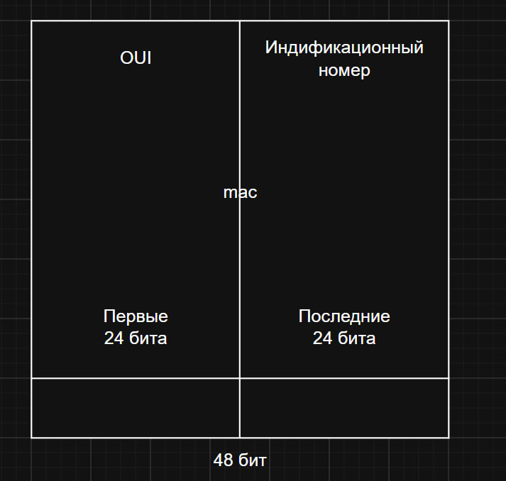
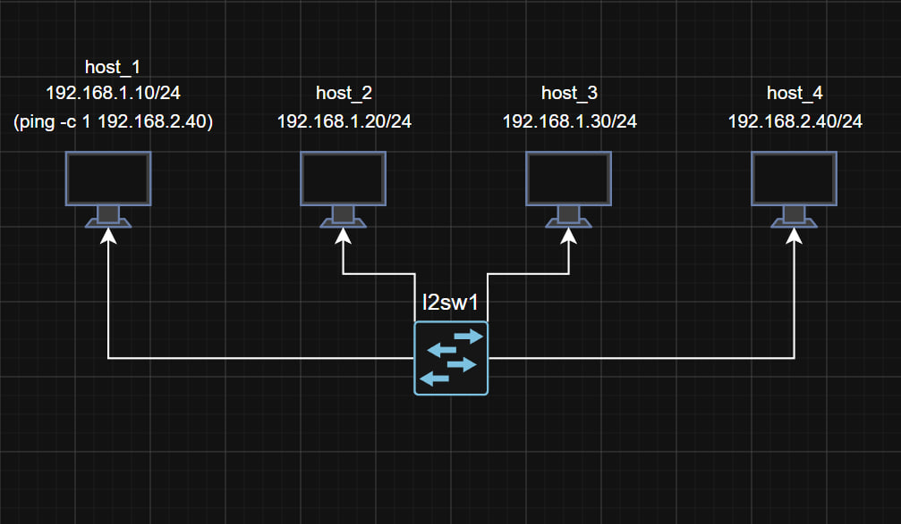
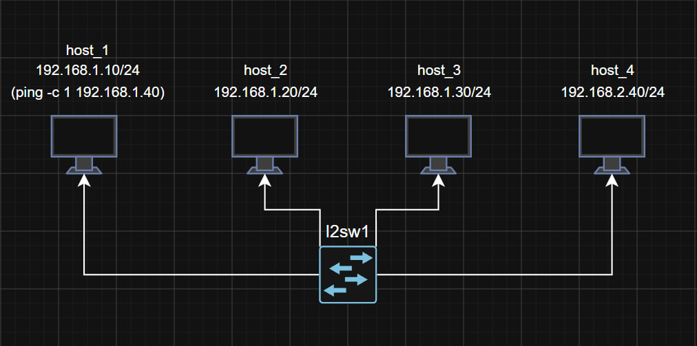

## Схема MAC-адреса

---

## Схема нерабочей сети

### Ошибка сети

**Проблема:** при команде `ping 192.168.2.40` от host_1 к host_4 передаётся 0 пакетов — связи нет.  
**Причина:** узлы находятся в разных подсетях. Коммутатор передаёт данные только внутри одной подсети. Для передачи пакета в другую сеть требуется маршрутизатор.

---

## Исправление ошибки

1. В настройках host_4 изменить IP‑адрес на `192.168.1.40`.
2. В настройках host_1 обновить команду на `ping 192.168.1.40`.

