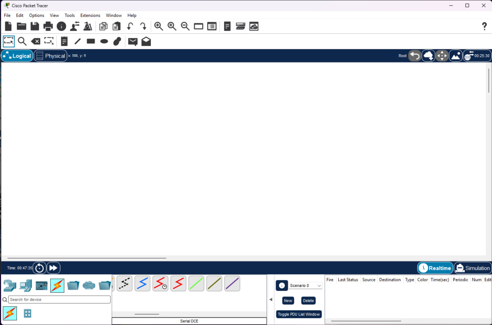

# Сегментация IP‑сетей: расчёты и распределение

## Задача 1. Сегментация сети 127.168.0.0/24 под 5 зданий (15–25 устройств в каждом)

### Дано
- Количество зданий (подсетей): $N_{зданий} = 5$
- Максимальное количество устройств в здании: $N_{устройств\_max} = 25$

### Ключевые шаги решения
1. **Расчёт битов под хосты**:  
   $2^n \geq 25 \Rightarrow n = 5$ ($2^5 = 32$ адреса, из них 30 пригодны для узлов).
2. **Расчёт битов под подсети**:  
   $2^k \geq 5 \Rightarrow k = 3$ ($2^3 = 8$ подсетей).
3. **Вычисление маски подсети**:  
   $/(24 + 3) = /27$ → $255.255.255.224$.

### Распределение подсетей

| № здания | Сеть | Диапазон адресов (ПК) |
| --- | --- | --- |
| 1 | `127.168.0.0/27` | `127.168.0.1` – `127.168.0.30` |
| 2 | `127.168.0.32/27` | `127.168.0.33` – `127.168.0.62` |
| 3 | `127.168.0.64/27` | `127.168.0.65` – `127.168.0.94` |
| 4 | `127.168.0.96/27` | `127.168.0.97` – `127.168.0.126` |
| 5 | `127.168.0.128/27` | `127.168.0.129` – `127.168.0.158` |

---

## Задача 2. Подбор маски под 20 подсетей и 10 узлов

### Дано
- Требуемое количество подсетей: $N_{подсетей} = 20$
- Требуемое количество узлов в подсети: $N_{узлов} = 10$

### Ключевые шаги решения
1. **Расчёт битов под хосты**:  
   $2^n \geq 10 \Rightarrow n = 4$ ($2^4 = 16$ адресов, 14 пригодны для узлов).
2. **Расчёт битов под подсети**:  
   $2^k \geq 20 \Rightarrow k = 5$ ($2^5 = 32$ подсети).
3. **Вычисление итоговой маски**:  
   Сумма битов: $5 + 4 = 9$.  
   Маска: $/(32 - 9) = /23$ (`255.255.254.0`).

### Важное замечание
В исходном решении предлагалась маска `/28`, но она даёт только 16 подсетей ($2^4$), чего недостаточно для 20 требуемых подсетей.  
**Корректный вариант — `/23`**, обеспечивающий 32 подсети по 14 хостов в каждой.

### Финальный ответ
Для 20 подсетей и 10 узлов подходит маска: **`/23`**.

